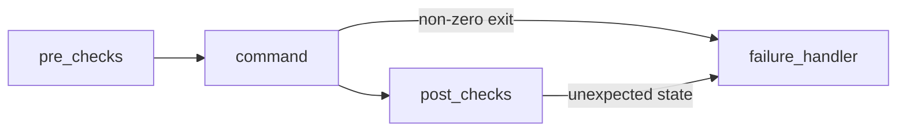

# Execution pipeline (gw do / gw fix)

Every runnable workflow follows the same four stages. This keeps behavior predictable and gives users clear next steps when git fails.



## 1. Pre-checks

Run **before** showing the final plan or immediately before execution (after user confirms).

| Goal | Examples |
|------|----------|
| Repo gates | `in_repo`, `has_upstream`, clean tree vs dirty |
| Recipe `requires` | From [`recipes.yaml`](../src/gitwise/recipes/recipes.yaml) |
| Conflict / op state | Merge or rebase already in progress |
| Safer defaults | Warn if pushing to `main` / default branch with `--force-with-lease` |
| Missing intent data | No branch name in intent when recipe needs `{name}` |

**Outcome:** Block with explanation, or proceed with warnings on the plan.

## 2. Command

Execute the rendered git command(s) via subprocess (`shell=False`), one step at a time for multi-step recipes.

- User must confirm first (`standard` / `elevated` confirmation levels).
- Capture stdout and stderr.
- Stop the chain on first non-zero exit unless a recipe explicitly defines continue-on-error (none in MVP).

## 3. Post-checks

Run **after** a successful exit code to verify the repo looks as expected.

| Goal | Examples |
|------|----------|
| Push | `ahead` count is 0 (or reduced); upstream ref exists |
| Pull | `behind` is 0; no `MERGE_HEAD` unless merge expected |
| Stash pop | Working tree has expected files; stash entry removed if `pop` |
| Branch switch | `git branch --show-current` matches target |
| Commit | `HEAD` moved; `has_staged` is false |

**Outcome:** Success message, or treat as partial failure → failure handler.

## 4. Failure handler

Run when pre-checks block execution, command exits non-zero, or post-checks fail.

### Inputs

- Recipe id and category
- Command that failed (index in multi-step list)
- Git stderr/stdout (sanitized — no secrets; truncate very long output)
- Fresh `RepoState` from `RepoInspector`

### Behavior

1. **Classify** the failure (pattern match on stderr + state):
   - merge conflict
   - rejected non-fast-forward
   - no upstream
   - permission / auth (SSH HTTPS)
   - dirty working tree would be overwritten
   - network / remote not found
   - unknown
2. **Explain** in plain language what happened and why git refused.
3. **Suggest next moves** — map to existing recipes or `gw fix` hints (do not auto-run):
   - push rejected + behind → `pull` then push again
   - merge conflict → resolve files, `git add`, `git commit` or `abort_merge_or_rebase`
   - no upstream → `push_new_branch_upstream`
4. **Prompt** (later): “What would you like to do next?” for interactive re-pick — out of scope for first `gw do` ship.

### Example: push fails due to non-fast-forward / conflicts

```text
Command failed: git push origin feature-x

Git reported:
  ! [rejected] feature-x -> feature-x (non-fast-forward)

What this means:
  The remote has commits you do not have locally. A plain push cannot succeed until
  you integrate those changes.

Suggested next moves:
  1. gw do "pull latest"          — merge remote into your branch
  2. gw fix "non-fast-forward"    — guided steps
  3. After resolving: gw do "push" again

Your repo now:
  … (short whereami-style summary)
```

## Implementation map (later)

| Module | Responsibility |
|--------|----------------|
| `gitwise/execution/pre_checks.py` | Recipe + state validators |
| `gitwise/execution/runner.py` | Subprocess chain |
| `gitwise/execution/post_checks.py` | Per-recipe-id verify hooks |
| `gitwise/execution/failures.py` | Classify stderr, build user message |
| `gitwise/execution/pipeline.py` | Orchestrate pre → cmd → post → fail |

Recipe YAML may grow optional fields (later):

```yaml
post_check: push_synced
on_failure: push_rejected
```

## Privacy

Failure handlers use only git output and repo state from the **current working directory**. No network APIs. Do not log remotes URLs or user paths outside the session unless the user opts in later.
